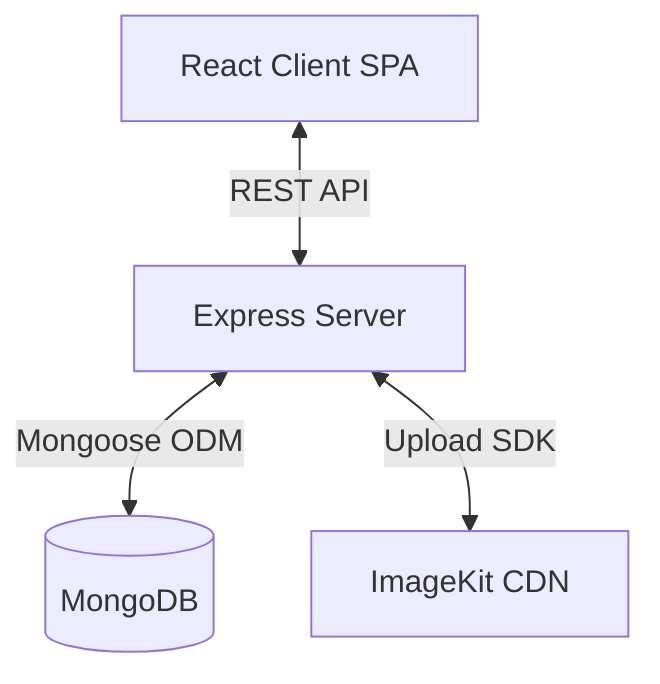

# Expense Tracker

## Overview
A full-stack web application built with the MERN stack (MongoDB, Express, React, Node.js) for tracking personal expenses. It allows users to register, log in, manage their expenses (add, edit, delete), upload a profile avatar, and view dashboard statistics to gain insights into their financial habits.

## Goals
- Provide a secure, easy-to-use platform for personal expense tracking.
- Categorize and visualize expense data for better financial insights.
- Offer responsive UI with a seamless user experience.

## Features
- **User Authentication**: Secure user registration and login using JSON Web Tokens (JWT).
- **Expense Management**: Complete CRUD (Create, Read, Update, Delete) operations for expense records.
- **Categorization**: Expenses are grouped into predefined categories (food, travel, entertainment, shopping, bills, other).
- **Dashboard**: Visual representations of expenses and aggregated statistics (e.g., total expenses, breakdown by category).
- **Expense Filtering & Reset**: Filter expenses by category, date range, and keyword search. A reset button clears all active filters at once.
- **Pagination**: Server-side pagination on the expenses list for scalable data handling.
- **Profile Avatar Upload**: Users can upload a profile picture, stored in ImageKit cloud. The avatar is displayed in the Navbar and links to the Profile page.
- **Responsive UI**: Fully responsive layout across mobile, tablet, and desktop screens. Text overflow is handled with truncation and tooltips.
- **Protected Routes**: Secure client-side access to the dashboard, expenses, and profile pages.

## Technology Stack
- **Frontend**: React 19, Vite, Tailwind CSS v4, React Router DOM v7, Redux Toolkit, React Hook Form, Zod (validation), Recharts (charts), Framer Motion (animations), Lucide React (icons), Sonner (toast notifications), Axios (HTTP client).
- **Backend**: Node.js, Express.js 5.
- **Database**: MongoDB via Mongoose.
- **Authentication**: JWT (JSON Web Tokens), bcrypt for password hashing.
- **File/Image Storage**: ImageKit (cloud CDN for avatar images).
- **File Uploads**: Multer (memory storage for processing before upload to ImageKit).
- **Environment Management**: dotenv.

## Project Architecture
The project follows a standard client-server architecture.
- **Frontend (Client)**: A Single Page Application (SPA) built with React and Vite. It communicates with the backend via RESTful APIs. Redux Toolkit is used to manage global state and API caching.
- **Backend (Server)**: A RESTful API built with Express.js that handles business logic, authentication, database operations, and image uploads.

## Folder Structure
- `client/`: Contains the frontend React application.
  - `src/assets/`: Static assets like images or icons.
  - `src/components/`: Reusable UI components.
    - `common/`: Shared components (`Button`, `Loader`, `Modal`, `UserAvatar`, `SearchInput`, `PageHeader`, `ErrorBanner`, `DeleteConfirmationModal`).
    - `dashboard/`: Dashboard-specific components (`StatsCard`, `RecentExpenses`, `ExpenseChart`, `MonthlyExpenseChart`).
    - `expense/`: Expense-specific components (`ExpenseTable`, `ExpenseForm`, `FilterBar`, `DateRangeFilter`, `Pagination`).
    - `layout/`: Layout components (`Navbar`, `Sidebar`).
    - `profile/`: Profile-specific components (`AvatarUploader`, `ProfileCard`, `AccountInfo`, `SecuritySettings`).
  - `src/constants/`: Application-wide constants.
  - `src/hooks/`: Custom React hooks.
  - `src/layouts/`: Layout wrappers (`DashboardLayout`, `AuthLayout`).
  - `src/pages/`: Main page components (`Login`, `Register`, `Dashboard`, `Expenses`, `Profile`).
  - `src/redux/`: Redux store configuration, state slices (`authSlice`, `expenseSlice`, `dashboardSlice`), and API service wrappers.
  - `src/services/`: Specific services handling Axios requests and configurations.
  - `src/utils/`: Utility functions and Zod validation schemas (`authSchema.js`, `expenseSchema.js`, `formatters.js`).
- `server/`: Contains the backend Node.js application.
  - `config/`: Database connection configuration (`db.js`).
  - `controllers/`: Business logic for handling incoming requests (`authController.js`, `expenseController.js`, `userController.js`).
  - `middleware/`: Custom Express middlewares (`authMiddleware.js`, `upload.js` for Multer).
  - `models/`: Mongoose schemas and models (`User.js`, `Expense.js`).
  - `routes/`: API endpoint definitions (`authRoutes.js`, `expenseRoutes.js`, `userRoutes.js`).
  - `services/`: Decoupled service integrations (`imageKitService.js`).
  - `utils/`: Helper functions and utilities.

## Core Modules
- **Authentication Module (`authController`, `authRoutes`, `User` model)**: Handles user registration, login, password hashing (bcrypt), and JWT generation.
- **Expense Module (`expenseController`, `expenseRoutes`, `Expense` model)**: Manages creating, fetching (with filtering, search, pagination), updating, and deleting expenses. Also provides dashboard statistics.
- **User/Profile Module (`userController`, `userRoutes`)**: Handles profile avatar uploads. Uses Multer (memory storage) to receive the file and delegates cloud upload to `imageKitService`.
- **ImageKit Service (`server/services/imageKitService.js`)**: Decoupled service that handles all ImageKit SDK interaction — authentication and uploading buffers to the CDN.
- **Redux Store (Frontend)**: Manages global state including user session (`authSlice` with `updateUser` reducer), dashboard data (`dashboardSlice`), and expense lists (`expenseSlice`).

## Application Flow
1. **User visits application**: The user interacts with the React frontend.
2. **Authentication**: If unauthenticated, the user is redirected to Login/Register. Form submissions trigger API calls (`axios`) to `/api/auth/login` or `/api/auth/register`.
3. **API Processing**: The server validates the data, performs database operations via Mongoose, and responds with a JWT on success.
4. **State Update**: The client stores the JWT and updates the Redux state (`authSlice`), then redirects to the Dashboard.
5. **Data Fetching**: Protected routes (Dashboard/Expenses) dispatch API calls to fetch data, attaching the JWT in the `Authorization` header.
6. **Data Display**: React components render the data, and charts (`recharts`) visualize the statistics.
7. **Avatar Upload**: User selects an image on the Profile page → Multer receives the file buffer → `imageKitService` uploads it to ImageKit → the returned CDN URL is saved to the User document in MongoDB → Redux state is updated via `updateUser` → Navbar avatar re-renders immediately.

## Data Models
### User
| Field | Type | Attributes |
| :--- | :--- | :--- |
| `name` | String | required, maxlength: 50 |
| `email` | String | required, unique, maxlength: 100 |
| `password` | String | required, min 8 chars, select: false |
| `avatarUrl` | String | optional — ImageKit CDN URL |

### Expense
| Field | Type | Attributes |
| :--- | :--- | :--- |
| `title` | String | required, maxlength: 50 |
| `amount` | Number | required, min: 0, max: 1,000,000,000 |
| `category` | String | required, enum: ['food', 'travel', 'entertainment', 'shopping', 'bills', 'other'], maxlength: 50 |
| `description` | String | optional, maxlength: 200 |
| `expenseDate` | Date | default: Date.now |
| `user` | ObjectId | ref: 'User', required |

## API Documentation
### Auth Routes (`/api/auth`)
- `POST /register`: Register a new user. Expects `name`, `email`, `password`.
- `POST /login`: Authenticate user. Expects `email`, `password`. Returns JWT and user object.

### Expense Routes (`/api/expenses`) - All require Auth
- `POST /expenses`: Create a new expense.
- `GET /expenses`: Get all expenses for the authenticated user. Supports query params: `page`, `limit`, `search`, `category`, `startDate`, `endDate`.
- `PUT /expenses/:id`: Update a specific expense.
- `DELETE /expenses/:id`: Delete a specific expense.
- `GET /stats`: Retrieve aggregated statistics for the user's dashboard.

### User Routes (`/api/user`) - All require Auth
- `POST /avatar`: Upload a new profile picture. Accepts `multipart/form-data` with field `avatar`. Returns updated user object with new `avatarUrl`.

## Configuration
- **Server `.env`**:
  - `PORT`: Server port (default 3000).
  - `MONGO_URI`: MongoDB connection string.
  - `JWT_SECRET`: Secret key for JWT signing.
  - `JWT_EXPIRES_IN`: Expiration time for JWT (e.g., `1h`).
  - `IMAGEKIT_PUBLIC_KEY`: ImageKit public API key.
  - `IMAGEKIT_PRIVATE_KEY`: ImageKit private API key.
  - `IMAGEKIT_URL_ENDPOINT`: ImageKit CDN URL endpoint.
- **Client `.env` (`client/src/.env`)**:
  - `VITE_APP_API_URL`: Base URL for backend API (e.g., `http://localhost:3000/api`).

## Build & Run
### Installation
1. Install server dependencies: `cd server && npm install`
2. Install client dependencies: `cd client && npm install`

### Running Locally
1. Start the backend server (development mode with Nodemon): `cd server && npm run dev`
2. Start the frontend client (development mode with Vite): `cd client && npm run dev`

### Building for Production
- Client: `cd client && npm run build` (Outputs to `client/dist`)

## Development Workflow
- **Frontend**: Vite provides fast HMR (Hot Module Replacement) during development. ESLint is configured for linting to maintain code quality.
- **Backend**: Nodemon is used for automatic server restarts upon file changes.
- **Styling**: Tailwind CSS v4 is used via the `@tailwindcss/vite` plugin for rapid UI development.

## Common Components (`client/src/components/common/`)
| Component | Purpose |
| :--- | :--- |
| `Button` | Reusable button with `variant` (`primary`, `outline`, `danger`) and optional icon support. |
| `UserAvatar` | Renders a user avatar — shows uploaded image if available, otherwise falls back to initials. Used in `Navbar` and `AvatarUploader`. |
| `Loader` | Full-area loading spinner. |
| `Modal` | Generic modal overlay wrapper. |
| `DeleteConfirmationModal` | Confirmation dialog for destructive delete actions. |
| `ErrorBanner` | Displays API error messages with a retry button. |
| `SearchInput` | Controlled search input, wired to URL search params. |
| `PageHeader` | Standardized page title + subtitle block. |

## Dependencies
### Client
- `@reduxjs/toolkit`, `react-redux`: Global state management.
- `react-router-dom`: Client-side routing.
- `axios`: Promise-based HTTP client for API calls.
- `react-hook-form`, `zod`, `@hookform/resolvers`: Form handling and schema-based validation.
- `recharts`: Charting library for the dashboard.
- `framer-motion`: Animation library for smooth UI transitions.
- `tailwindcss`, `lucide-react`, `sonner`: UI, styling, icons, and notifications.

### Server
- `express`: Fast, unopinionated web framework.
- `mongoose`: MongoDB object modeling tool.
- `jsonwebtoken`: Implementation of JSON Web Tokens for auth.
- `bcrypt`: Library to hash passwords securely.
- `dotenv`: Loads environment variables from a `.env` file.
- `cors`: Express middleware to enable Cross-Origin Resource Sharing.
- `multer`: Middleware for handling `multipart/form-data` (file uploads).
- `imagekit`: Official ImageKit Node.js SDK for cloud image storage.

## Security Considerations
- **Authentication**: JWT-based stateless authentication protects user sessions.
- **Passwords**: Passwords are hashed securely using `bcrypt` before storage. They are never returned in queries (`select: false`).
- **Authorization**: `authMiddleware` protects private routes, decoding the JWT to ensure users only access their own data.
- **CORS**: Enabled on the server to manage cross-origin requests.
- **File Uploads**: Multer uses memory storage (no disk writes) and the file buffer is passed directly to ImageKit, reducing server-side file exposure.

## Performance Considerations
- **Database Indexing**: The `email` field in the User model is unique, which implicitly creates an index for faster lookups. The `user` field in the Expense model is indexed for efficient per-user queries.
- **Server-side Pagination**: Expenses are paginated on the server (default 10 per page) to prevent loading large datasets into memory.
- **CDN for Images**: Profile images are served via ImageKit's CDN, offloading bandwidth and enabling fast global delivery.
- **Client Build**: Vite is used for an optimized, fast production build of the React application.

## Input Validation & Limits
| Field | Limit |
| :--- | :--- |
| User name | min 3, max 50 characters |
| User email | valid email format, max 100 characters |
| User password | min 8 characters |
| Expense title | min 1, max 50 characters |
| Expense amount | greater than 0, max ₹1,000,000,000 |
| Expense category | min 1, max 50 characters |
| Expense description | optional, max 200 characters |
| Avatar file size | max 5 MB |
| Avatar file types | JPEG, PNG, WebP |

Validation is enforced both on the **client** (via Zod schemas in `authSchema.js` and `expenseSchema.js`) and should be mirrored on the **server** for security.

## Responsive Design Notes
- Layout uses Tailwind CSS breakpoints: `sm` (640px), `md` (768px), `lg` (1024px).
- `overflow-x: hidden` is set globally on `html` and `body` to prevent horizontal scroll on mobile.
- `min-width: 0` is applied to common HTML block elements (div, span, p, headings, etc.) to allow flex children to shrink and enable text truncation.
- Long text values (names, emails, expense titles, categories, amounts) are truncated with CSS `text-overflow: ellipsis` and have native `title` attributes for full-value hover tooltips.
- Expense table columns have `max-width` constraints and use `truncate` for overflow control.
- `StatsCard` values truncate when amounts are very large, preventing dashboard layout breakage.

## Known Limitations
- A refresh token mechanism is not implemented. Users will be logged out once the JWT expires, requiring re-authentication.
- No export functionality (CSV/PDF) for expense reports yet.

## Future Improvements
- Add a robust refresh token flow for better UX.
- Add "Export to CSV/PDF" functionality for expense reports.
- Advanced sorting options on the expenses table (e.g., sort by amount, date).
- Email notifications or reminders for budget tracking.
- Multi-currency support.

## Troubleshooting
- **Database Connection Error**: Ensure `MONGO_URI` is correctly set in `server/.env` and your IP is whitelisted on the MongoDB cluster.
- **CORS Issues**: If the frontend cannot communicate with the backend, verify that the frontend URL (e.g., `localhost:5173`) is allowed by the server's CORS configuration.
- **Missing API URL**: Ensure `VITE_APP_API_URL` is set in `client/src/.env` and points to the running backend server.
- **ImageKit Upload Failing**: Verify that `IMAGEKIT_PUBLIC_KEY`, `IMAGEKIT_PRIVATE_KEY`, and `IMAGEKIT_URL_ENDPOINT` are all correctly set in `server/.env`.
- **Avatar Not Updating in Navbar**: Ensure the `updateUser` Redux action is dispatched after a successful avatar upload to sync the Redux `auth` state.
