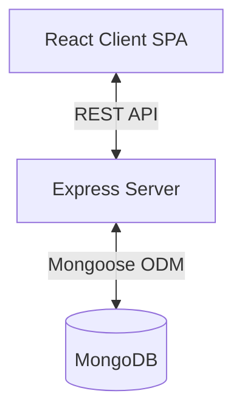

# Expense Tracker

## Overview
A full-stack web application built with the MERN stack (MongoDB, Express, React, Node.js) for tracking personal expenses. It allows users to register, log in, manage their expenses (add, edit, delete), and view dashboard statistics to gain insights into their financial habits.

## Goals
- Provide a secure, easy-to-use platform for personal expense tracking.
- Categorize and visualize expense data for better financial insights.
- Offer responsive UI with a seamless user experience.

## Features
- **User Authentication**: Secure user registration and login using JSON Web Tokens (JWT).
- **Expense Management**: Complete CRUD (Create, Read, Update, Delete) operations for expense records.
- **Categorization**: Expenses are grouped into predefined categories (food, travel, entertainment, shopping, bills, other).
- **Dashboard**: Visual representations of expenses and aggregated statistics (e.g., total expenses, breakdown by category).
- **Responsive UI**: Accessible on multiple device sizes with modern animations.
- **Protected Routes**: Secure client-side access to the dashboard, expenses, and profile pages.

## Technology Stack
- **Frontend**: React 19, Vite, Tailwind CSS v4, React Router DOM v7, Redux Toolkit, React Hook Form, Zod (validation), Recharts (charts), Framer Motion (animations), Lucide React (icons), Sonner (toast notifications), Axios (HTTP client).
- **Backend**: Node.js, Express.js 5.
- **Database**: MongoDB via Mongoose.
- **Authentication**: JWT (JSON Web Tokens), bcrypt for password hashing.
- **Environment Management**: dotenv.

## Project Architecture
The project follows a standard client-server architecture.
- **Frontend (Client)**: A Single Page Application (SPA) built with React and Vite. It communicates with the backend via RESTful APIs. Redux Toolkit is used to manage global state and API caching.
- **Backend (Server)**: A RESTful API built with Express.js that handles business logic, authentication, and database operations.

## Folder Structure
- `client/`: Contains the frontend React application.
  - `src/assets/`: Static assets like images or icons.
  - `src/components/`: Reusable UI components.
  - `src/constants/`: Application-wide constants.
  - `src/hooks/`: Custom React hooks.
  - `src/layouts/`: Layout components (e.g., `DashboardLayout`, `ProtectedRoute`).
  - `src/pages/`: Main page components (`Login`, `Register`, `Dashboard`, `Expenses`, `Profile`).
  - `src/redux/`: Redux store configuration, state slices, and API service wrappers.
  - `src/services/`: Specific services handling Axios requests and configurations.
  - `src/utils/`: Utility functions.
- `server/`: Contains the backend Node.js application.
  - `config/`: Database connection configuration (`db.js`).
  - `controllers/`: Business logic for handling incoming requests (`authController.js`, `expenseController.js`).
  - `middleware/`: Custom Express middlewares (`authMiddleware.js`).
  - `models/`: Mongoose schemas and models (`User.js`, `Expense.js`).
  - `routes/`: API endpoint definitions (`authRoutes.js`, `expenseRoutes.js`).
  - `utils/`: Helper functions and utilities.

## Core Modules
- **Authentication Module (`authController`, `authRoutes`, `User` model)**: Handles user registration, login, password hashing (bcrypt), and JWT generation.
- **Expense Module (`expenseController`, `expenseRoutes`, `Expense` model)**: Manages creating, fetching, updating, and deleting expenses. It also provides an endpoint to calculate and fetch dashboard statistics.
- **Redux Store (Frontend)**: Manages global state including user session (`authSlice`), dashboard data (`dashboardSlice`), and expense lists (`expenseSlice`).

## Application Flow
1. **User visits application**: The user interacts with the React frontend.
2. **Authentication**: If unauthenticated, the user is redirected to Login/Register. Form submissions trigger API calls (`axios`) to `/api/auth/login` or `/api/auth/register`.
3. **API Processing**: The server validates the data, performs database operations via Mongoose, and responds with a JWT on success.
4. **State Update**: The client stores the JWT and updates the Redux state (`authSlice`), then redirects to the Dashboard.
5. **Data Fetching**: Protected routes (Dashboard/Expenses) dispatch API calls to fetch data, attaching the JWT in the `Authorization` header.
6. **Data Display**: React components render the data, and charts (`recharts`) visualize the statistics.

## Data Models
### User
| Field | Type | Attributes |
| :--- | :--- | :--- |
| `name` | String | required |
| `email` | String | required, unique |
| `password` | String | required, min 8 chars, select: false |

### Expense
| Field | Type | Attributes |
| :--- | :--- | :--- |
| `title` | String | required |
| `amount` | Number | required, min: 0 |
| `category` | String | required, enum: ['food', 'travel', 'entertainment', 'shopping', 'bills', 'other'] |
| `description` | String | maxlength: 200 |
| `expenseDate` | Date | default: Date.now |
| `user` | ObjectId | ref: 'User', required |

## API Documentation
### Auth Routes (`/api/auth`)
- `POST /register`: Register a new user. Expects `name`, `email`, `password`.
- `POST /login`: Authenticate user. Expects `email`, `password`. Returns JWT and user object.

### Expense Routes (`/api/expenses`) - All require Auth
- `POST /expenses`: Create a new expense.
- `GET /expenses`: Get all expenses for the authenticated user.
- `PUT /expenses/:id`: Update a specific expense.
- `DELETE /expenses/:id`: Delete a specific expense.
- `GET /stats`: Retrieve aggregated statistics for the user's dashboard.

## Configuration
- **Server `.env`**:
  - `PORT`: Server port (default 3000).
  - `MONGO_URI`: MongoDB connection string.
  - `JWT_SECRET`: Secret key for JWT signing.
  - `JWT_EXPIRES_IN`: Expiration time for JWT (e.g., `1h`).
- **Client `.env` (`client/src/.env`)**:
  - `VITE_APP_API_URL`: Base URL for backend API (e.g., `http://localhost:3000/api`).

## Build & Run
### Installation
1. Install server dependencies: `cd server && npm install`
2. Install client dependencies: `cd client && npm install`

### Running Locally
1. Start the backend server (development mode with Nodemon): `cd server && npm run dev`
2. Start the frontend client (development mode with Vite): `cd client && npm run dev`

### Building for Production
- Client: `cd client && npm run build` (Outputs to `client/dist`)

## Development Workflow
- **Frontend**: Vite provides fast HMR (Hot Module Replacement) during development. ESLint is configured for linting to maintain code quality.
- **Backend**: Nodemon is used for automatic server restarts upon file changes.
- **Styling**: Tailwind CSS v4 is used via the `@tailwindcss/vite` plugin for rapid UI development.

## Dependencies
### Client
- `@reduxjs/toolkit`, `react-redux`: Global state management.
- `react-router-dom`: Client-side routing.
- `axios`: Promise-based HTTP client for API calls.
- `react-hook-form`, `zod`, `@hookform/resolvers`: Form handling and schema-based validation.
- `recharts`: Charting library for the dashboard.
- `framer-motion`: Animation library for smooth UI transitions.
- `tailwindcss`, `lucide-react`, `sonner`: UI, styling, icons, and notifications.

### Server
- `express`: Fast, unopinionated web framework.
- `mongoose`: MongoDB object modeling tool.
- `jsonwebtoken`: Implementation of JSON Web Tokens for auth.
- `bcrypt`: Library to hash passwords securely.
- `dotenv`: Loads environment variables from a `.env` file.
- `cors`: Express middleware to enable Cross-Origin Resource Sharing.

## Security Considerations
- **Authentication**: JWT-based stateless authentication protects user sessions.
- **Passwords**: Passwords are hashed securely using `bcrypt` before storage. They are never returned in queries (`select: false`).
- **Authorization**: `authMiddleware` protects private routes, decoding the JWT to ensure users only access their own data.
- **CORS**: Enabled on the server to manage cross-origin requests.

## Performance Considerations
- **Database Indexing**: The `email` field in the User model is unique, which implicitly creates an index for faster lookups. *(Assumption: further indexing might be beneficial on the `user` field in the Expense model for query performance).*
- **Client Build**: Vite is used for an optimized, fast production build of the React application.

## Known Limitations
- *(Assumption)* No pagination is implemented for expenses, which may impact performance and UX as the user's data grows.
- *(Assumption)* A refresh token mechanism is not evident. Users will be logged out once the JWT expires (`JWT_EXPIRES_IN`), requiring frequent re-authentication if the expiry is short.

## Future Improvements
- Implement pagination or infinite scrolling for the expenses list.
- Add a robust refresh token flow for better UX.
- Include user profile image uploading and storage.
- Add "Export to CSV/PDF" functionality for expense reports.
- Advanced filtering and sorting options on the expenses page.

## Troubleshooting
- **Database Connection Error**: Ensure `MONGO_URI` is correctly set in `server/.env` and your IP is whitelisted on the MongoDB cluster.
- **CORS Issues**: If the frontend cannot communicate with the backend, verify that the frontend URL (e.g., `localhost:5173`) is allowed by the server's CORS configuration.
- **Missing API URL**: Ensure `VITE_APP_API_URL` is set in `client/src/.env` and points to the running backend server.
