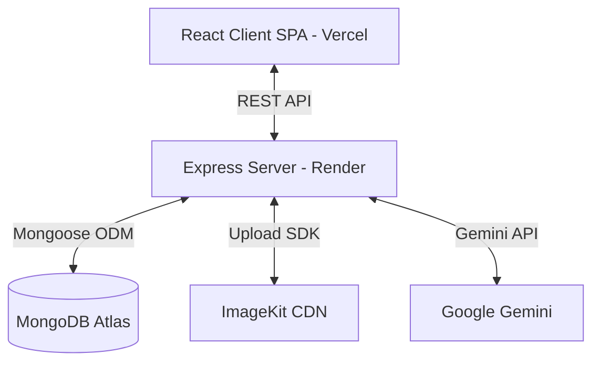

# Expense Tracker

## Overview

A full-stack web application built with the MERN stack (MongoDB, Express, React, Node.js) for tracking personal expenses. It allows users to register, log in, manage their expenses (add, edit, delete — including via natural-language AI parsing), upload a profile avatar, set monthly budgets, and export their data as CSV/PDF reports. The app supports both light and dark themes throughout, and is deployed live (frontend on Vercel, backend on Render, database on MongoDB Atlas).

## Goals

- Provide a secure, easy-to-use platform for personal expense tracking.
- Categorize and visualize expense data for better financial insights.
- Help users set and stay within spending limits via budgets.
- Let users take their data with them via CSV/PDF export.
- Make expense entry as frictionless as describing it in plain English.
- Offer responsive UI with a seamless user experience, in both light and dark themes, on any device.

## Features

- **User Authentication**: Secure user registration and login using JSON Web Tokens (JWT). Password fields support a show/hide visibility toggle.
- **AI-Powered Quick Add**: Describe an expense in plain language (e.g. "Spent 500 on pizza yesterday") and Gemini parses it into a structured draft — title, amount, category, and date — which opens pre-filled in the standard Add Expense form for review before saving. A "Enter manually instead" option is always available as a fallback.
- **Expense Management**: Complete CRUD (Create, Read, Update, Delete) operations for expense records.
- **Categorization**: Expenses are grouped into predefined categories (food, travel, entertainment, shopping, bills, other).
- **Budget Tracking**: Users can set monthly spending limits per category and/or an overall monthly cap. Progress is visualized with color-coded bars (green/amber/red), and past/future months can be browsed and edited independently.
- **Budget-Aware Expense Entry**: Before saving an expense (whether entered manually or via AI parsing) that would push a category or the overall budget over its limit, the user sees an inline warning and must explicitly confirm ("Save Anyway") before it's saved. A distinct toast confirms when an expense was saved over budget.
- **CSV/PDF Export**: Export expenses as a CSV (for spreadsheets) or a formatted PDF report (summary stats, category breakdown, a budget snapshot for the relevant month, and the full expense table). Choose to export all expenses or just the currently filtered/searched view.
- **Dashboard**: Visual representations of expenses and aggregated statistics (e.g., total expenses, breakdown by category), plus a "Budget Health" summary showing categories nearing or over their limit for the current month.
- **Expense Filtering & Reset**: Filter expenses by category, date range, and keyword search. A reset button clears all active filters at once.
- **Pagination**: Server-side pagination on the expenses list for scalable data handling.
- **Profile Avatar Upload**: Users can upload a profile picture, stored in ImageKit cloud. The avatar is displayed in the Navbar and links to the Profile page.
- **Dark Mode**: A manual light/dark theme toggle (Navbar), persisted in `localStorage`, with an OS-preference fallback on first visit and no flash-of-wrong-theme on reload. Theme-aware logo and auth page imagery swap automatically.
- **Smart Routing**: Visiting the app's root URL redirects to the Dashboard if logged in, or Login if not. Unknown routes show a themed 404 page with a button back to the right place based on auth state, rather than a blank screen.
- **Responsive UI**: Fully responsive layout across mobile, tablet, and desktop screens, including the auth pages (Login/Register), which show a compact branded header on mobile in place of the hidden illustration. Text overflow is handled with truncation and tooltips. Modals cap their height to the viewport and scroll internally rather than overflowing the screen.
- **Protected Routes**: Secure client-side access to the dashboard, expenses, budgets, and profile pages.

## Technology Stack

- **Frontend**: React 19, Vite, Tailwind CSS v4 (CSS-first config, class-based dark mode via `@custom-variant`), React Router DOM v7, Redux Toolkit, React Hook Form, Zod (validation), Recharts (charts, theme-aware colors), Framer Motion (animations), Lucide React (icons), Sonner (toast notifications, theme-aware), Axios (HTTP client), jsPDF + jspdf-autotable (client-side PDF report generation).
- **Backend**: Node.js, Express.js 5.
- **Database**: MongoDB via Mongoose (hosted on MongoDB Atlas).
- **Authentication**: JWT (JSON Web Tokens), bcrypt for password hashing.
- **AI**: Google Gemini API (`@google/genai` SDK) for natural-language expense parsing, using a flash-tier model for fast, low-cost structured extraction with JSON-constrained output.
- **File/Image Storage**: ImageKit (cloud CDN for avatar images).
- **File Uploads**: Multer (memory storage for processing before upload to ImageKit).
- **Environment Management**: dotenv.
- **Hosting**: Vercel (frontend, static Vite build), Render (backend, Node web service), MongoDB Atlas (database).

## Project Architecture

The project follows a standard client-server architecture, deployed as two independently hosted services sharing one database.

- **Frontend (Client)**: A Single Page Application (SPA) built with React and Vite, deployed on Vercel. It communicates with the backend via RESTful APIs. Redux Toolkit is used to manage global state (auth, expenses, dashboard, budgets, theme) and API caching.
- **Backend (Server)**: A RESTful API built with Express.js, deployed on Render as a persistent Node web service (not serverless — chosen deliberately so Mongoose maintains a stable connection pool rather than reconnecting per request). Handles business logic, authentication, database operations, budget aggregation, export generation, AI parsing, and image uploads.



## Folder Structure

- `client/`: Contains the frontend React application.
  - `public/`: Static assets served as-is at the site root, including `logo.png` (browser tab favicon).
  - `src/assets/`: Bundled static assets like images or icons, including theme-specific variants (e.g. `Logo.png` / `Logo_Darks.png`, `login.jpeg` / `Auth_Dark.png`).
  - `src/components/`: Reusable UI components.
    - `common/`: Shared components (`Button`, `Loader`, `Modal`, `UserAvatar`, `SearchInput`, `PageHeader`, `ErrorBanner`, `DeleteConfirmationModal`, `AuthButton`, `ChartCard`, `EmptyChart`, `ErrorBoundary`, `FormField`, `ThemeToggle`, `AppToaster`).
    - `dashboard/`: Dashboard-specific components (`StatsCard`, `RecentExpenses`, `ExpenseChart`, `MonthlyExpenseChart`, `BudgetHealth`).
    - `expense/`: Expense-specific components (`ExpenseTable`, `ExpenseForm`, `FilterBar`, `DateRangeFilter`, `Pagination`, `ExportModal`, `QuickAddExpenseModal`).
    - `budget/`: Budget-specific components (`BudgetForm`, `BudgetCard`, `BudgetOverview`, `MonthSelector`).
    - `layout/`: Layout and routing components (`Navbar`, `Sidebar`, `ProtectedRoute`, `RootRedirect`).
    - `profile/`: Profile-specific components (`AvatarUploader`, `ProfileCard`, `AccountInfo`, `SecuritySettings`).
  - `src/constants/`: Application-wide constants (`categories.js`).
  - `src/hooks/`: Custom React hooks.
  - `src/layouts/`: Layout wrappers (`DashboardLayout`, `AuthLayout`).
  - `src/pages/`: Main page components (`Login`, `Register`, `Dashboard`, `Expenses`, `Budgets`, `Profile`, `NotFound`).
  - `src/redux/`: Redux store configuration, state slices (`authSlice`, `expenseSlice`, `dashboardSlice`, `budgetSlice`, `themeSlice`), and API service wrappers under `redux/services/` (`expenseApi.js`, `dashboardApi.js`, `budgetApi.js`, `authApi.js`, `exportApi.js`, `aiApi.js`).
  - `src/utils/`: Utility functions, Zod validation schemas (`authSchema.js`, `expenseSchema.js`, `budgetSchema.js`, `formatters.js`), theme helpers (`theme.js`), and export helpers (`pdfExport.js` — client-side PDF report generation).
- `server/`: Contains the backend Node.js application.
  - `config/`: Database connection configuration (`db.js`).
  - `controllers/`: Business logic for handling incoming requests (`authController.js`, `expenseController.js`, `userController.js`, `budgetController.js`, `aiController.js`).
  - `middleware/`: Custom Express middlewares (`authMiddleware.js`, `upload.js` for Multer).
  - `models/`: Mongoose schemas and models (`User.js`, `Expense.js`, `Budget.js`).
  - `routes/`: API endpoint definitions (`authRoutes.js`, `expenseRoutes.js`, `userRoutes.js`, `budgetRoutes.js`, `aiRoutes.js`).
  - `services/`: Decoupled service integrations (`imageKitService.js`, `aiService.js` — wraps the Gemini API call and prompt construction).
  - `utils/`: Helper functions and utilities.

## Core Modules

- **Authentication Module (`authController`, `authRoutes`, `User` model)**: Handles user registration, login, password hashing (bcrypt), and JWT generation.
- **Expense Module (`expenseController`, `expenseRoutes`, `Expense` model)**: Manages creating, fetching (with filtering, search, pagination), updating, and deleting expenses. Provides dashboard statistics via server-side aggregation (including per-category and trailing-12-month totals for the dashboard charts). Checks projected budget impact before an expense is saved and refreshes budget status after any expense change.
- **AI Module (`aiService`, `aiController`, `aiRoutes`, `QuickAddExpenseModal`)**: Parses free-text expense descriptions into structured drafts using the Gemini API. The prompt supplies the current server date (for resolving relative dates like "yesterday") and the exact category enum, and constrains the model's output to JSON via `responseMimeType`. The controller never trusts the model's output blindly — invalid categories fall back to `other`, a missing/invalid amount fails the request outright rather than guessing, unparseable dates fall back to today, and a missing title falls back to a truncated version of the raw input. Parsed drafts are handed to the existing `ExpenseForm` for user review — never saved directly — so all existing validation and budget-check logic applies unchanged.
- **Export Module (`exportExpenses` in `expenseController`, `ExportModal`, `pdfExport.js`)**: Exposes a filter-aware, non-paginated export endpoint returning either a streamed CSV file or JSON (used to build a PDF client-side). Shares its filter-building logic with `getExpenses` via a common helper. The PDF includes a summary, category breakdown, and a budget snapshot for whichever month the export covers (or the current month, if the export spans multiple months or is unfiltered).
- **Budget Module (`budgetController`, `budgetRoutes`, `Budget` model)**: Manages creating/updating (upsert by user + category + month), fetching, and deleting monthly budgets — per category or an `'overall'` cap. Provides a `status` aggregation endpoint that joins budgeted limits with actual spend for a given month, returning spent/limit/remaining/percentage per category and overall.
- **User/Profile Module (`userController`, `userRoutes`)**: Handles profile avatar uploads. Uses Multer (memory storage) to receive the file and delegates cloud upload to `imageKitService`.
- **ImageKit Service (`server/services/imageKitService.js`)**: Decoupled service that handles all ImageKit SDK interaction — authentication and uploading buffers to the CDN.
- **Theme Module (`themeSlice`, `utils/theme.js`, `ThemeToggle`)**: Manages light/dark mode state, persists the choice to `localStorage`, falls back to OS preference on first visit, and applies the theme class before React mounts (via an inline script in `index.html`) to prevent a flash of the wrong theme.
- **Routing Module (`RootRedirect`, `ProtectedRoute`, `NotFound`)**: `RootRedirect` sends `/` to `/dashboard` or `/login` based on auth state; `ProtectedRoute` guards the authenticated route tree the same way; unmatched paths (`*`) render a themed `NotFound` page whose "back" button also respects auth state.
- **Redux Store (Frontend)**: Manages global state including user session (`authSlice` with `updateUser` reducer), dashboard data (`dashboardSlice`), expense lists (`expenseSlice`), budgets and status (`budgetSlice`), and theme (`themeSlice`).

## Application Flow

1. **App boot**: An inline script in `index.html` reads the stored theme preference (or OS preference) and applies the `dark` class to `<html>` before React renders, avoiding a flash of the wrong theme.
2. **Routing on load**: Visiting `/` (or any unrecognized path) checks `isAuthenticated` and redirects to `/dashboard` or `/login` accordingly; a genuinely unknown path instead shows the `NotFound` page.
3. **Authentication**: If unauthenticated, the user is redirected to Login/Register. Form submissions trigger API calls (`axios`) to `/api/auth/login` or `/api/auth/register`. Auth page imagery swaps automatically based on the active theme, and on mobile (where that imagery is hidden) a compact branded header takes its place.
4. **API Processing**: The server validates the data, performs database operations via Mongoose, and responds with a JWT on success.
5. **State Update**: The client stores the JWT and updates the Redux state (`authSlice`), then redirects to the Dashboard.
6. **Data Fetching**: Protected routes (Dashboard/Expenses/Budgets) dispatch API calls to fetch data, attaching the JWT in the `Authorization` header.
7. **Data Display**: React components render the data, and charts (`recharts`) visualize server-aggregated statistics, with theme-aware colors for gridlines, axes, and tooltips.
8. **Adding an Expense (AI-assisted)**: Clicking "Add Expense" opens the Quick Add modal. The user describes the expense in plain text; it's sent to `/api/ai/parse-expense`, parsed and sanitized server-side, and the result opens pre-filled in the standard expense form (flagged as AI-parsed) for review — or the user can bypass this entirely via "Enter manually instead" for a blank form.
9. **Adding/Editing an Expense (validation)**: Regardless of entry path, before the expense is saved, the client checks projected spend against the relevant category and overall budgets for that expense's month. If it would exceed a limit, the user sees an inline warning and must confirm "Save Anyway" before the API call is made; a distinct toast confirms an over-budget save.
10. **Budget Tracking**: On the Budgets page, users set/edit per-category or overall limits for any month (past, current, or future) via a modal form; `BudgetOverview` renders color-coded progress cards, refetched whenever the selected month changes or an expense affecting that month is created/updated/deleted.
11. **Exporting Data**: From the Expenses page, the user picks a scope (all expenses or the current filtered view) and a format (CSV or PDF). CSV is streamed directly from the server; PDF is assembled client-side from the same export endpoint's JSON response plus a budget-status lookup for the relevant month.
12. **Avatar Upload**: User selects an image on the Profile page → Multer receives the file buffer → `imageKitService` uploads it to ImageKit → the returned CDN URL is saved to the User document in MongoDB → Redux state is updated via `updateUser` → Navbar avatar re-renders immediately.

## Data Models

### User

| Field       | Type   | Attributes                           |
| :---------- | :----- | :----------------------------------- |
| `name`      | String | required, maxlength: 50              |
| `email`     | String | required, unique, maxlength: 100     |
| `password`  | String | required, min 8 chars, select: false |
| `avatarUrl` | String | optional — ImageKit CDN URL          |

### Expense

| Field         | Type     | Attributes                                                                                       |
| :------------ | :------- | :----------------------------------------------------------------------------------------------- |
| `title`       | String   | required, maxlength: 50                                                                          |
| `amount`      | Number   | required, min: 0, max: 1,000,000,000                                                             |
| `category`    | String   | required, enum: ['food', 'travel', 'entertainment', 'shopping', 'bills', 'other'], maxlength: 50 |
| `description` | String   | optional, maxlength: 200                                                                         |
| `expenseDate` | Date     | default: Date.now                                                                                |
| `user`        | ObjectId | ref: 'User', required                                                                            |

### Budget

| Field      | Type     | Attributes                                                                                   |
| :--------- | :------- | :------------------------------------------------------------------------------------------- |
| `category` | String   | required, enum: ['food', 'travel', 'entertainment', 'shopping', 'bills', 'other', 'overall'] |
| `amount`   | Number   | required, min: 0                                                                             |
| `month`    | String   | required, format `YYYY-MM`                                                                   |
| `user`     | ObjectId | ref: 'User', required                                                                        |

Compound unique index on `{ user, category, month }` — one budget document per user, per category, per month; saving a budget upserts rather than duplicating.

## API Documentation

### Auth Routes (`/api/auth`)

- `POST /register`: Register a new user. Expects `name`, `email`, `password`.
- `POST /login`: Authenticate user. Expects `email`, `password`. Returns JWT and user object.

### Expense Routes (`/api/expenses`) - All require Auth

- `POST /expenses`: Create a new expense.
- `GET /expenses`: Get all expenses for the authenticated user. Supports query params: `page`, `limit`, `search`, `category`, `startDate`, `endDate`.
- `PUT /expenses/:id`: Update a specific expense.
- `DELETE /expenses/:id`: Delete a specific expense.
- `GET /stats`: Retrieve aggregated dashboard statistics, including `categoryBreakdown` (all-time totals per category) and `monthlyBreakdown` (trailing 12 months of totals) used to power the dashboard charts.
- `GET /expenses/export`: Export matching expenses (same filters as `GET /expenses`, but unpaginated, capped at 5,000 records). `?format=csv` streams a downloadable CSV file; omitting `format` returns JSON (`{ expenses, summary }`) for client-side PDF generation.

### Budget Routes (`/api/budgets`) - All require Auth

- `POST /budgets`: Create or update (upsert) a budget. Expects `category`, `amount`, `month` (`YYYY-MM`).
- `GET /budgets?month=YYYY-MM`: Get all budgets set for the given month.
- `GET /budgets/status?month=YYYY-MM`: Get spend-vs-limit status for every category and the overall cap for the given month — returns `{ month, categories: [{ category, spent, limit, remaining, percentage }], overall: {...} }`.
- `DELETE /budgets/:id`: Delete a specific budget.

### AI Routes (`/api/ai`) - Requires Auth

- `POST /parse-expense`: Parses a free-text expense description via Gemini. Expects `{ text }`. Returns `{ success, parsed: { title, amount, category, expenseDate, description } }`, with the result sanitized against the valid category enum and a strictly-validated positive amount.

### User Routes (`/api/users`) - All require Auth

- `POST /avatar`: Upload a new profile picture. Accepts `multipart/form-data` with field `avatar`. Returns updated user object with new `avatarUrl`.

## Configuration

- **Server `.env`** (set in Render's Environment settings for the deployed instance):
  - `PORT`: Server port (Render injects its own; not manually set in production).
  - `MONGO_URI`: MongoDB Atlas connection string.
  - `JWT_SECRET`: Secret key for JWT signing.
  - `JWT_EXPIRES_IN`: Expiration time for JWT (e.g., `1h`).
  - `IMAGEKIT_PUBLIC_KEY`: ImageKit public API key.
  - `IMAGEKIT_PRIVATE_KEY`: ImageKit private API key.
  - `IMAGEKIT_URL_ENDPOINT`: ImageKit CDN URL endpoint.
  - `GEMINI_API_KEY`: Google Gemini API key (from Google AI Studio), used for natural-language expense parsing.
  - `GEMINI_MODEL`: Gemini model name to use (currently `gemini-3.5-flash`; Google has rotated flash-tier model names multiple times in recent months, so this is kept configurable rather than hardcoded).
- **Client `.env` / Vercel Environment Variable**:
  - `VITE_APP_API_URL`: Base URL for the deployed backend API (e.g., `https://your-app.onrender.com/api`). Since Vite bakes this in at build time, changing it requires a redeploy, not just a restart.

No additional environment variables are required for Dark Mode, Budgets, or Export — all are implemented using existing infrastructure.

## Deployment

- **Frontend**: Deployed on Vercel. Root Directory: `client`. Build Command: `npm run build`. Output Directory: `dist`. A `client/vercel.json` rewrite rule sends all paths to `index.html` so client-side routing (React Router) doesn't 404 on refresh:
  ```json
  { "rewrites": [{ "source": "/(.*)", "destination": "/index.html" }] }
  ```
- **Backend**: Deployed on Render as a persistent Node web service (not serverless functions — chosen so Mongoose keeps a stable connection pool). Root Directory: `server`. Build Command: `npm install`. Start Command: `npm start`. Render's free tier spins down after ~15 minutes of inactivity; the first request after idle can take 20–30 seconds to respond. Remember to add `GEMINI_API_KEY` and `GEMINI_MODEL` alongside the other environment variables here.
- **Database**: MongoDB Atlas. Network Access allows `0.0.0.0/0` since Render's free tier doesn't provide a fixed outbound IP; access is still protected by the credentials embedded in `MONGO_URI`.
- **CORS**: Currently open (`app.use(cors())`, no origin restriction). Since auth uses JWT-in-header (not cookies), this isn't a credential-leaking risk, but it can optionally be tightened to the deployed frontend's exact origin.

## Build & Run

### Installation

1. Install server dependencies: `cd server && npm install`
2. Install client dependencies: `cd client && npm install`

### Running Locally

1. Start the backend server (development mode with Nodemon): `cd server && npm run dev`
2. Start the frontend client (development mode with Vite): `cd client && npm run dev`

### Building for Production

- Client: `cd client && npm run build` (Outputs to `client/dist`)

## Development Workflow

- **Frontend**: Vite provides fast HMR (Hot Module Replacement) during development. ESLint is configured for linting to maintain code quality.
- **Backend**: Nodemon is used for automatic server restarts upon file changes locally; Render runs the production `start` script directly (no Nodemon in production).
- **Styling**: Tailwind CSS v4 is used via the `@tailwindcss/vite` plugin for rapid UI development. Dark mode uses the class-based strategy via a `@custom-variant dark (&:where(.dark, .dark *));` directive in `index.css` (Tailwind v4's CSS-first config has no `tailwind.config.js`).

## Common Components (`client/src/components/common/`)

| Component                 | Purpose                                                                                                                                                                                |
| :------------------------ | :------------------------------------------------------------------------------------------------------------------------------------------------------------------------------------- |
| `Button`                  | Reusable button with `variant` (`primary`, `secondary`, `outline`, `danger`, `ghost`, `dangerOutline`) and optional icon support.                                                      |
| `UserAvatar`              | Renders a user avatar — shows uploaded image if available, otherwise falls back to initials. Used in `Navbar` and `AvatarUploader`.                                                    |
| `Loader`                  | Full-area loading spinner.                                                                                                                                                             |
| `Modal`                   | Generic modal overlay wrapper. Caps height at 90vh with an internally scrolling body, so tall content (e.g. a form plus a budget warning) never crops off-screen.                      |
| `DeleteConfirmationModal` | Confirmation dialog for destructive delete actions.                                                                                                                                    |
| `ErrorBanner`             | Displays API error messages with a retry button.                                                                                                                                       |
| `SearchInput`             | Controlled search input, wired to URL search params.                                                                                                                                   |
| `PageHeader`              | Standardized page title + subtitle block.                                                                                                                                              |
| `AuthButton`              | Thin `Button` wrapper preset for auth forms (full-width, submit type).                                                                                                                 |
| `ChartCard`               | Shared animated wrapper for dashboard chart cards (title + empty state + content).                                                                                                     |
| `EmptyChart`              | Empty-state illustration shown inside `ChartCard` when there's no data yet.                                                                                                            |
| `ErrorBoundary`           | Class component catching render errors app-wide, shows a themed fallback screen with reload option.                                                                                    |
| `FormField`               | Reusable labeled input/select/textarea wrapper with inline error display and a show/hide toggle for `type="password"` fields; used across auth forms, `ExpenseForm`, and `BudgetForm`. |
| `ThemeToggle`             | Sun/moon icon button in the Navbar that toggles light/dark mode.                                                                                                                       |
| `AppToaster`              | Theme-aware wrapper around Sonner's `<Toaster>`, so toast colors match the active theme.                                                                                               |

## Dependencies

### Client

- `@reduxjs/toolkit`, `react-redux`: Global state management.
- `react-router-dom`: Client-side routing.
- `axios`: Promise-based HTTP client for API calls.
- `react-hook-form`, `zod`, `@hookform/resolvers`: Form handling and schema-based validation (expenses and budgets).
- `recharts`: Charting library for the dashboard, with theme-aware color props for dark mode.
- `framer-motion`: Animation library for smooth UI transitions.
- `tailwindcss`, `lucide-react`, `sonner`: UI, styling, icons, and notifications (Sonner themed to match light/dark mode).
- `jspdf`, `jspdf-autotable`: Client-side PDF report generation for the Export feature.

### Server

- `express`: Fast, unopinionated web framework.
- `mongoose`: MongoDB object modeling tool.
- `jsonwebtoken`: Implementation of JSON Web Tokens for auth.
- `bcrypt`: Library to hash passwords securely.
- `dotenv`: Loads environment variables from a `.env` file.
- `cors`: Express middleware to enable Cross-Origin Resource Sharing.
- `multer`: Middleware for handling `multipart/form-data` (file uploads).
- `imagekit`: Official ImageKit Node.js SDK for cloud image storage.
- `@google/genai`: Official Google Gemini SDK, used for natural-language expense parsing.

## Security Considerations

- **Authentication**: JWT-based stateless authentication protects user sessions.
- **Passwords**: Passwords are hashed securely using `bcrypt` before storage. They are never returned in queries (`select: false`). The show/hide visibility toggle on password fields is purely a client-side UI convenience and has no effect on how passwords are transmitted or stored.
- **Authorization**: `authMiddleware` protects private routes, decoding the JWT to ensure users only access their own data — including budgets, exports, and AI parsing requests, which are always scoped to `req.user._id` or otherwise gated behind a valid session.
- **AI Input Handling**: User-supplied free text is sent to the Gemini API for parsing, but the model's output is never trusted or persisted blindly — the server validates the category against a fixed enum, rejects invalid/non-positive amounts outright, and falls back sensibly on ambiguous dates or missing titles. Parsed results are never auto-saved; they always require explicit user confirmation via the standard expense form.
- **CORS**: Enabled on the server to manage cross-origin requests; currently unrestricted by origin (see Deployment section for the tradeoff).
- **File Uploads**: Multer uses memory storage (no disk writes) and the file buffer is passed directly to ImageKit, reducing server-side file exposure.
- **Database Network Access**: MongoDB Atlas allows connections from any IP (`0.0.0.0/0`) to accommodate Render's dynamic egress IPs; access is still gated by the credentials in `MONGO_URI`.

## Performance Considerations

- **Database Indexing**: The `email` field in the User model is unique, which implicitly creates an index for faster lookups. The `user` field in the Expense model is indexed for efficient per-user queries. The `Budget` model has a compound unique index on `{ user, category, month }`, keeping per-month lookups and upserts fast while preventing duplicate budget documents.
- **Server-side Pagination**: Expenses are paginated on the server (default 10 per page) to prevent loading large datasets into memory.
- **CDN for Images**: Profile images are served via ImageKit's CDN, offloading bandwidth and enabling fast global delivery.
- **Client Build**: Vite is used for an optimized, fast production build of the React application.
- **Dashboard Chart Aggregation**: Category and monthly totals for the dashboard charts are computed entirely via MongoDB aggregation (`categoryBreakdown`, `monthlyBreakdown` on `/stats`) rather than fetching raw expense records to the client — this scales correctly regardless of how many expenses a user accumulates, replacing an earlier approach that fetched up to 1,000 raw records for client-side aggregation.
- **Budget Status Aggregation**: Spend-per-category is computed server-side via a single Mongo aggregation (`$match` + `$group`) per request rather than pulling all expenses to the client, keeping the Budgets page and Dashboard's "Budget Health" section fast even as expense history grows.
- **Export**: The export endpoint reuses the same aggregation-based approach for its summary/category breakdown, and caps the raw record count returned at 5,000 to keep response sizes and PDF generation time bounded.
- **AI Parsing**: Uses a flash-tier Gemini model deliberately, rather than a larger/slower one — this is a short structured-extraction task, not a task needing deep reasoning, so the cheaper, faster model is the right tradeoff.
- **Render Cold Starts**: On the free tier, the backend spins down after ~15 minutes idle; the first request afterward incurs a 20–30 second cold-start delay. Not addressed in the current deployment (would require a paid tier or a keep-alive ping).

## Input Validation & Limits

| Field                 | Limit                                                                       |
| :-------------------- | :-------------------------------------------------------------------------- |
| User name             | min 3, max 50 characters                                                    |
| User email            | valid email format, max 100 characters                                      |
| User password         | min 8 characters                                                            |
| Expense title         | min 1, max 50 characters                                                    |
| Expense amount        | greater than 0, max ₹1,000,000,000                                          |
| Expense category      | min 1, max 50 characters                                                    |
| Expense description   | optional, max 200 characters                                                |
| Budget amount         | greater than 0, max ₹1,000,000,000                                          |
| Budget category       | required, one of the expense categories or `overall`                        |
| Budget month          | required, `YYYY-MM` format                                                  |
| Avatar file size      | max 5 MB                                                                    |
| Avatar file types     | JPEG, PNG, WebP                                                             |
| Export record cap     | 5,000 expenses per export request                                           |
| AI-parsed title       | truncated to 50 characters (falls back to raw input if the model omits one) |
| AI-parsed description | truncated to 200 characters                                                 |

Validation is enforced both on the **client** (via Zod schemas in `authSchema.js`, `expenseSchema.js`, and `budgetSchema.js`) and mirrored on the **server** (Mongoose schema validation, plus explicit month-format checks in `budgetController.js` and category/amount/date sanitization in `aiController.js`, since neither Mongoose validators nor client-side Zod run on data coming back from an external AI service).

## Responsive Design Notes

- Layout uses Tailwind CSS breakpoints: `sm` (640px), `md` (768px), `lg` (1024px).
- `overflow-x: hidden` is set globally on `html` and `body` to prevent horizontal scroll on mobile.
- `min-width: 0` is applied to common HTML block elements (div, span, p, headings, etc.) to allow flex children to shrink and enable text truncation.
- Long text values (names, emails, expense titles, categories, amounts) are truncated with CSS `text-overflow: ellipsis` and have native `title` attributes for full-value hover tooltips.
- Expense table columns have `max-width` constraints and use `truncate` for overflow control.
- `StatsCard` values truncate when amounts are very large, preventing dashboard layout breakage.
- `Modal` caps its height at `90vh` and scrolls its body internally, so growing content (e.g. a form plus an over-budget warning) never crops off the top or bottom of the screen.
- Native date inputs (`DateRangeFilter`, `ExpenseForm`) use `[color-scheme:dark]` in dark mode so the browser's calendar picker icon renders visibly instead of a black-on-black icon.
- `AuthLayout` (Login/Register) only applies its fixed `95vh` height on `lg` screens and up, where the two-column image layout needs it; on mobile the card sizes to its content and centers correctly instead of leaving empty space. A compact branded header (logo + app name + tagline) appears only on mobile, replacing the context normally provided by the hidden illustration.
- The Expenses page toolbar separates page-level actions (Export, Add Expense) from filtering controls (Category, Date Range, Reset) into two distinct rows, each of which independently wraps/stacks per breakpoint rather than relying on manual margin offsets.

## Known Limitations

- A refresh token mechanism is not implemented. Users will be logged out once the JWT expires, requiring re-authentication.
- Budget-vs-expense checks compare against the month derived from the expense's date; editing an expense's category _and_ moving it to a different month in the same edit is a rarer edge case where the old amount may not be perfectly subtracted from its original category/month before the new projection is calculated.
- Export is capped at 5,000 records per request; a user with more expenses than that in a single export scope will have older records silently excluded rather than paginated or warned about.
- The deployed backend (Render free tier) spins down when idle, causing a noticeable delay on the first request after a period of inactivity.
- AI parsing depends on an external Gemini model whose name/availability has changed multiple times in recent months; the model name is configurable via `GEMINI_MODEL` specifically to make swapping it quick when a model is deprecated.
- No automated test coverage (unit/integration) exists yet for either the client or server.

## Future Improvements

- Add a robust refresh token flow for better UX.
- Add automated test coverage (e.g. Jest/Supertest for controllers, React Testing Library for key components).
- Recurring expenses (auto-generate entries on a schedule).
- Advanced sorting options on the expenses table (e.g., sort by amount, date).
- Email notifications or reminders for budget tracking.
- Multi-currency support.
- Budget rollover (carry unused budget into the next month) or recurring budget templates.
- Raise or paginate past the current export record cap for very high-volume users.
- AI receipt scanning (image upload → extracted expense, reusing the existing Multer/ImageKit upload path).
- Conversational spending insights (chat-style Q&A over a user's own aggregated expense/budget data).

## Troubleshooting

- **Database Connection Error**: Ensure `MONGO_URI` is correctly set (in Render's environment for the deployed instance, or `server/.env` locally) and that MongoDB Atlas's Network Access allows the connecting IP (`0.0.0.0/0` is used in production due to Render's dynamic egress IPs).
- **CORS Issues**: If the frontend cannot communicate with the backend, verify that the frontend's origin is allowed by the server's CORS configuration.
- **Missing API URL**: Ensure `VITE_APP_API_URL` is set correctly (Vercel Environment Variables in production, `client/src/.env` locally) and points to the running backend. Remember this is baked in at build time — changing it requires a redeploy.
- **404 on Page Refresh (Production)**: If refreshing a route like `/dashboard` or `/budgets` on the deployed Vercel site shows a 404, confirm `client/vercel.json`'s rewrite rule is present and was included in the deployed build.
- **Backend Feels Slow on First Request**: Render's free tier spins down after ~15 minutes of inactivity; the first request after idle can take 20–30 seconds. This is expected on the current hosting tier, not a bug.
- **ImageKit Upload Failing**: Verify that `IMAGEKIT_PUBLIC_KEY`, `IMAGEKIT_PRIVATE_KEY`, and `IMAGEKIT_URL_ENDPOINT` are all correctly set wherever the backend is running.
- **Avatar Not Updating in Navbar**: Ensure the `updateUser` Redux action is dispatched after a successful avatar upload to sync the Redux `auth` state.
- **Dark Mode Flashes on Load**: Confirm the inline theme-detection script is present as early as possible in `index.html`'s `<head>` — if it's missing, the page will briefly flash the light theme before React mounts and applies the stored preference.
- **Budget Status Returns Empty/Wrong Data**: Confirm the `month` query param is in strict `YYYY-MM` format (e.g. `2026-07`, not `2026-7` or `2026-13`) — both `getBudgets` and `getBudgetStatus` validate this format and return `400` otherwise.
- **Budget Warning Doesn't Appear on an Over-Budget Expense**: The check fails open — if the `GET /budgets/status` call errors out (e.g. server down), `ExpenseForm` silently allows the save rather than blocking it. Check the network tab if a warning you expect isn't showing.
- **Export Seems to Be Missing Records**: Check whether the matching record count exceeds the 5,000-record export cap.
- **Favicon Not Updating**: Browsers cache favicons aggressively. If a new tab icon (`client/public/logo.png`) doesn't appear after deploying, try a hard refresh or an incognito window before assuming it's broken.
- **AI Quick Add Returns "Couldn't understand that"**: Check the server console for the underlying Gemini error (logged explicitly in `aiController.js`). A common cause is Google deprecating the configured `GEMINI_MODEL` for new API keys — check Google AI Studio for the current recommended flash-tier model name and update the env var accordingly.
- **AI Quick Add Fails with a 404 Mentioning "no longer available to new users"**: The model in `GEMINI_MODEL` has been deprecated for new keys. Swap it for the currently recommended flash model (check Google's quickstart docs, since this has changed multiple times) and restart the server.
