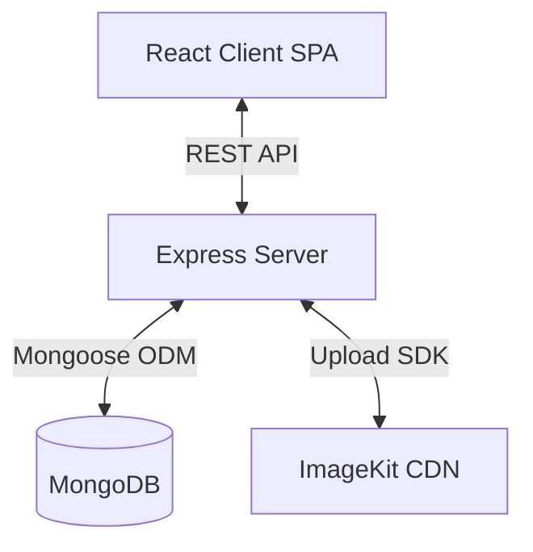

# Expense Tracker

## Overview

A full-stack web application built with the MERN stack (MongoDB, Express, React, Node.js) for tracking personal expenses. It allows users to register, log in, manage their expenses (add, edit, delete), upload a profile avatar, set monthly budgets, and view dashboard statistics to gain insights into their financial habits. The app supports both light and dark themes throughout.

## Goals

- Provide a secure, easy-to-use platform for personal expense tracking.
- Categorize and visualize expense data for better financial insights.
- Help users set and stay within spending limits via budgets.
- Offer responsive UI with a seamless user experience, in both light and dark themes.

## Features

- **User Authentication**: Secure user registration and login using JSON Web Tokens (JWT).
- **Expense Management**: Complete CRUD (Create, Read, Update, Delete) operations for expense records.
- **Categorization**: Expenses are grouped into predefined categories (food, travel, entertainment, shopping, bills, other).
- **Budget Tracking**: Users can set monthly spending limits per category and/or an overall monthly cap. Progress is visualized with color-coded bars (green/amber/red), and past/future months can be browsed and edited independently.
- **Budget-Aware Expense Entry**: Before saving an expense that would push a category or the overall budget over its limit, the user sees an inline warning and must explicitly confirm ("Save Anyway") before it's saved. A distinct toast confirms when an expense was saved over budget.
- **Dashboard**: Visual representations of expenses and aggregated statistics (e.g., total expenses, breakdown by category), plus a "Budget Health" summary showing categories nearing or over their limit for the current month.
- **Expense Filtering & Reset**: Filter expenses by category, date range, and keyword search. A reset button clears all active filters at once.
- **Pagination**: Server-side pagination on the expenses list for scalable data handling.
- **Profile Avatar Upload**: Users can upload a profile picture, stored in ImageKit cloud. The avatar is displayed in the Navbar and links to the Profile page.
- **Dark Mode**: A manual light/dark theme toggle (Navbar), persisted in `localStorage`, with an OS-preference fallback on first visit and no flash-of-wrong-theme on reload. Theme-aware logo and auth page imagery swap automatically.
- **Responsive UI**: Fully responsive layout across mobile, tablet, and desktop screens. Text overflow is handled with truncation and tooltips. Modals cap their height to the viewport and scroll internally rather than overflowing the screen.
- **Protected Routes**: Secure client-side access to the dashboard, expenses, budgets, and profile pages.

## Technology Stack

- **Frontend**: React 19, Vite, Tailwind CSS v4 (CSS-first config, class-based dark mode via `@custom-variant`), React Router DOM v7, Redux Toolkit, React Hook Form, Zod (validation), Recharts (charts, theme-aware colors), Framer Motion (animations), Lucide React (icons), Sonner (toast notifications, theme-aware), Axios (HTTP client).
- **Backend**: Node.js, Express.js 5.
- **Database**: MongoDB via Mongoose.
- **Authentication**: JWT (JSON Web Tokens), bcrypt for password hashing.
- **File/Image Storage**: ImageKit (cloud CDN for avatar images).
- **File Uploads**: Multer (memory storage for processing before upload to ImageKit).
- **Environment Management**: dotenv.

## Project Architecture

The project follows a standard client-server architecture.

- **Frontend (Client)**: A Single Page Application (SPA) built with React and Vite. It communicates with the backend via RESTful APIs. Redux Toolkit is used to manage global state (auth, expenses, dashboard, budgets, theme) and API caching.
- **Backend (Server)**: A RESTful API built with Express.js that handles business logic, authentication, database operations, budget aggregation, and image uploads.

## Folder Structure

- `client/`: Contains the frontend React application.
  - `src/assets/`: Static assets like images or icons, including theme-specific variants (e.g. `Logo.png` / `Logo_Darks.png`, `login.jpeg` / `Auth_Dark.png`).
  - `src/components/`: Reusable UI components.
    - `common/`: Shared components (`Button`, `Loader`, `Modal`, `UserAvatar`, `SearchInput`, `PageHeader`, `ErrorBanner`, `DeleteConfirmationModal`, `AuthButton`, `ChartCard`, `EmptyChart`, `ErrorBoundary`, `FormField`, `ThemeToggle`, `AppToaster`).
    - `dashboard/`: Dashboard-specific components (`StatsCard`, `RecentExpenses`, `ExpenseChart`, `MonthlyExpenseChart`, `BudgetHealth`).
    - `expense/`: Expense-specific components (`ExpenseTable`, `ExpenseForm`, `FilterBar`, `DateRangeFilter`, `Pagination`).
    - `budget/`: Budget-specific components (`BudgetForm`, `BudgetCard`, `BudgetOverview`, `MonthSelector`).
    - `layout/`: Layout components (`Navbar`, `Sidebar`).
    - `profile/`: Profile-specific components (`AvatarUploader`, `ProfileCard`, `AccountInfo`, `SecuritySettings`).
  - `src/constants/`: Application-wide constants (`categories.js`).
  - `src/hooks/`: Custom React hooks.
  - `src/layouts/`: Layout wrappers (`DashboardLayout`, `AuthLayout`).
  - `src/pages/`: Main page components (`Login`, `Register`, `Dashboard`, `Expenses`, `Budgets`, `Profile`).
  - `src/redux/`: Redux store configuration, state slices (`authSlice`, `expenseSlice`, `dashboardSlice`, `budgetSlice`, `themeSlice`), and API service wrappers under `redux/services/` (`expenseApi.js`, `dashboardApi.js`, `budgetApi.js`, `authApi.js`).
  - `src/utils/`: Utility functions, Zod validation schemas (`authSchema.js`, `expenseSchema.js`, `budgetSchema.js`, `formatters.js`), and theme helpers (`theme.js` — reads/persists the theme preference and applies the `dark` class).
- `server/`: Contains the backend Node.js application.
  - `config/`: Database connection configuration (`db.js`).
  - `controllers/`: Business logic for handling incoming requests (`authController.js`, `expenseController.js`, `userController.js`, `budgetController.js`).
  - `middleware/`: Custom Express middlewares (`authMiddleware.js`, `upload.js` for Multer).
  - `models/`: Mongoose schemas and models (`User.js`, `Expense.js`, `Budget.js`).
  - `routes/`: API endpoint definitions (`authRoutes.js`, `expenseRoutes.js`, `userRoutes.js`, `budgetRoutes.js`).
  - `services/`: Decoupled service integrations (`imageKitService.js`).
  - `utils/`: Helper functions and utilities.

## Core Modules

- **Authentication Module (`authController`, `authRoutes`, `User` model)**: Handles user registration, login, password hashing (bcrypt), and JWT generation.
- **Expense Module (`expenseController`, `expenseRoutes`, `Expense` model)**: Manages creating, fetching (with filtering, search, pagination), updating, and deleting expenses. Also provides dashboard statistics. Checks projected budget impact before an expense is saved (via the client-side budget module) and refreshes budget status after any expense change.
- **Budget Module (`budgetController`, `budgetRoutes`, `Budget` model)**: Manages creating/updating (upsert by user + category + month), fetching, and deleting monthly budgets — per category or an `'overall'` cap. Provides a `status` aggregation endpoint that joins budgeted limits with actual spend for a given month, returning spent/limit/remaining/percentage per category and overall.
- **User/Profile Module (`userController`, `userRoutes`)**: Handles profile avatar uploads. Uses Multer (memory storage) to receive the file and delegates cloud upload to `imageKitService`.
- **ImageKit Service (`server/services/imageKitService.js`)**: Decoupled service that handles all ImageKit SDK interaction — authentication and uploading buffers to the CDN.
- **Theme Module (`themeSlice`, `utils/theme.js`, `ThemeToggle`)**: Manages light/dark mode state, persists the choice to `localStorage`, falls back to OS preference on first visit, and applies the theme class before React mounts (via an inline script in `index.html`) to prevent a flash of the wrong theme.
- **Redux Store (Frontend)**: Manages global state including user session (`authSlice` with `updateUser` reducer), dashboard data (`dashboardSlice`), expense lists (`expenseSlice`), budgets and status (`budgetSlice`), and theme (`themeSlice`).

## Application Flow

1. **App boot**: An inline script in `index.html` reads the stored theme preference (or OS preference) and applies the `dark` class to `<html>` before React renders, avoiding a flash of the wrong theme.
2. **User visits application**: The user interacts with the React frontend.
3. **Authentication**: If unauthenticated, the user is redirected to Login/Register. Form submissions trigger API calls (`axios`) to `/api/auth/login` or `/api/auth/register`. Auth page imagery swaps automatically based on the active theme.
4. **API Processing**: The server validates the data, performs database operations via Mongoose, and responds with a JWT on success.
5. **State Update**: The client stores the JWT and updates the Redux state (`authSlice`), then redirects to the Dashboard.
6. **Data Fetching**: Protected routes (Dashboard/Expenses/Budgets) dispatch API calls to fetch data, attaching the JWT in the `Authorization` header.
7. **Data Display**: React components render the data, and charts (`recharts`) visualize the statistics, with theme-aware colors for gridlines, axes, and tooltips.
8. **Adding/Editing an Expense**: Before the expense is saved, the client checks projected spend against the relevant category and overall budgets for that expense's month. If it would exceed a limit, the user sees an inline warning and must confirm "Save Anyway" before the API call is made; a distinct toast confirms an over-budget save.
9. **Budget Tracking**: On the Budgets page, users set/edit per-category or overall limits for any month (past, current, or future) via a modal form; `BudgetOverview` renders color-coded progress cards, refetched whenever the selected month changes or an expense affecting that month is created/updated/deleted.
10. **Avatar Upload**: User selects an image on the Profile page → Multer receives the file buffer → `imageKitService` uploads it to ImageKit → the returned CDN URL is saved to the User document in MongoDB → Redux state is updated via `updateUser` → Navbar avatar re-renders immediately.

## Data Models

### User

| Field       | Type   | Attributes                           |
| :---------- | :----- | :----------------------------------- |
| `name`      | String | required, maxlength: 50              |
| `email`     | String | required, unique, maxlength: 100     |
| `password`  | String | required, min 8 chars, select: false |
| `avatarUrl` | String | optional — ImageKit CDN URL          |

### Expense

| Field         | Type     | Attributes                                                                                       |
| :------------ | :------- | :----------------------------------------------------------------------------------------------- |
| `title`       | String   | required, maxlength: 50                                                                          |
| `amount`      | Number   | required, min: 0, max: 1,000,000,000                                                             |
| `category`    | String   | required, enum: ['food', 'travel', 'entertainment', 'shopping', 'bills', 'other'], maxlength: 50 |
| `description` | String   | optional, maxlength: 200                                                                         |
| `expenseDate` | Date     | default: Date.now                                                                                |
| `user`        | ObjectId | ref: 'User', required                                                                            |

### Budget

| Field      | Type     | Attributes                                                                                   |
| :--------- | :------- | :------------------------------------------------------------------------------------------- |
| `category` | String   | required, enum: ['food', 'travel', 'entertainment', 'shopping', 'bills', 'other', 'overall'] |
| `amount`   | Number   | required, min: 0                                                                             |
| `month`    | String   | required, format `YYYY-MM`                                                                   |
| `user`     | ObjectId | ref: 'User', required                                                                        |

Compound unique index on `{ user, category, month }` — one budget document per user, per category, per month; saving a budget upserts rather than duplicating.

## API Documentation

### Auth Routes (`/api/auth`)

- `POST /register`: Register a new user. Expects `name`, `email`, `password`.
- `POST /login`: Authenticate user. Expects `email`, `password`. Returns JWT and user object.

### Expense Routes (`/api/expenses`) - All require Auth

- `POST /expenses`: Create a new expense.
- `GET /expenses`: Get all expenses for the authenticated user. Supports query params: `page`, `limit`, `search`, `category`, `startDate`, `endDate`.
- `PUT /expenses/:id`: Update a specific expense.
- `DELETE /expenses/:id`: Delete a specific expense.
- `GET /stats`: Retrieve aggregated statistics for the user's dashboard.

### Budget Routes (`/api/budgets`) - All require Auth

- `POST /budgets`: Create or update (upsert) a budget. Expects `category`, `amount`, `month` (`YYYY-MM`).
- `GET /budgets?month=YYYY-MM`: Get all budgets set for the given month.
- `GET /budgets/status?month=YYYY-MM`: Get spend-vs-limit status for every category and the overall cap for the given month — returns `{ month, categories: [{ category, spent, limit, remaining, percentage }], overall: {...} }`.
- `DELETE /budgets/:id`: Delete a specific budget.

### User Routes (`/api/users`) - All require Auth

- `POST /avatar`: Upload a new profile picture. Accepts `multipart/form-data` with field `avatar`. Returns updated user object with new `avatarUrl`.

## Configuration

- **Server `.env`**:
  - `PORT`: Server port (default 3000).
  - `MONGO_URI`: MongoDB connection string.
  - `JWT_SECRET`: Secret key for JWT signing.
  - `JWT_EXPIRES_IN`: Expiration time for JWT (e.g., `1h`).
  - `IMAGEKIT_PUBLIC_KEY`: ImageKit public API key.
  - `IMAGEKIT_PRIVATE_KEY`: ImageKit private API key.
  - `IMAGEKIT_URL_ENDPOINT`: ImageKit CDN URL endpoint.
- **Client `.env` (`client/src/.env`)**:
  - `VITE_APP_API_URL`: Base URL for backend API (e.g., `http://localhost:3000/api`).

No additional environment variables are required for Dark Mode or Budgets — both are implemented entirely with existing infrastructure (client-side `localStorage` for theme; the existing MongoDB connection for budgets).

## Build & Run

### Installation

1. Install server dependencies: `cd server && npm install`
2. Install client dependencies: `cd client && npm install`

### Running Locally

1. Start the backend server (development mode with Nodemon): `cd server && npm run dev`
2. Start the frontend client (development mode with Vite): `cd client && npm run dev`

### Building for Production

- Client: `cd client && npm run build` (Outputs to `client/dist`)

## Development Workflow

- **Frontend**: Vite provides fast HMR (Hot Module Replacement) during development. ESLint is configured for linting to maintain code quality.
- **Backend**: Nodemon is used for automatic server restarts upon file changes.
- **Styling**: Tailwind CSS v4 is used via the `@tailwindcss/vite` plugin for rapid UI development. Dark mode uses the class-based strategy via a `@custom-variant dark (&:where(.dark, .dark *));` directive in `index.css` (Tailwind v4's CSS-first config has no `tailwind.config.js`).

## Common Components (`client/src/components/common/`)

| Component                 | Purpose                                                                                                                                                           |
| :------------------------ | :---------------------------------------------------------------------------------------------------------------------------------------------------------------- |
| `Button`                  | Reusable button with `variant` (`primary`, `secondary`, `outline`, `danger`, `ghost`, `dangerOutline`) and optional icon support.                                 |
| `UserAvatar`              | Renders a user avatar — shows uploaded image if available, otherwise falls back to initials. Used in `Navbar` and `AvatarUploader`.                               |
| `Loader`                  | Full-area loading spinner.                                                                                                                                        |
| `Modal`                   | Generic modal overlay wrapper. Caps height at 90vh with an internally scrolling body, so tall content (e.g. a form plus a budget warning) never crops off-screen. |
| `DeleteConfirmationModal` | Confirmation dialog for destructive delete actions.                                                                                                               |
| `ErrorBanner`             | Displays API error messages with a retry button.                                                                                                                  |
| `SearchInput`             | Controlled search input, wired to URL search params.                                                                                                              |
| `PageHeader`              | Standardized page title + subtitle block.                                                                                                                         |
| `AuthButton`              | Thin `Button` wrapper preset for auth forms (full-width, submit type).                                                                                            |
| `ChartCard`               | Shared animated wrapper for dashboard chart cards (title + empty state + content).                                                                                |
| `EmptyChart`              | Empty-state illustration shown inside `ChartCard` when there's no data yet.                                                                                       |
| `ErrorBoundary`           | Class component catching render errors app-wide, shows a themed fallback screen with reload option.                                                               |
| `FormField`               | Reusable labeled input/select/textarea wrapper with inline error display, used by both `ExpenseForm` and `BudgetForm`.                                            |
| `ThemeToggle`             | Sun/moon icon button in the Navbar that toggles light/dark mode.                                                                                                  |
| `AppToaster`              | Theme-aware wrapper around Sonner's `<Toaster>`, so toast colors match the active theme.                                                                          |

## Dependencies

### Client

- `@reduxjs/toolkit`, `react-redux`: Global state management.
- `react-router-dom`: Client-side routing.
- `axios`: Promise-based HTTP client for API calls.
- `react-hook-form`, `zod`, `@hookform/resolvers`: Form handling and schema-based validation (expenses and budgets).
- `recharts`: Charting library for the dashboard, with theme-aware color props for dark mode.
- `framer-motion`: Animation library for smooth UI transitions.
- `tailwindcss`, `lucide-react`, `sonner`: UI, styling, icons, and notifications (Sonner themed to match light/dark mode).

### Server

- `express`: Fast, unopinionated web framework.
- `mongoose`: MongoDB object modeling tool.
- `jsonwebtoken`: Implementation of JSON Web Tokens for auth.
- `bcrypt`: Library to hash passwords securely.
- `dotenv`: Loads environment variables from a `.env` file.
- `cors`: Express middleware to enable Cross-Origin Resource Sharing.
- `multer`: Middleware for handling `multipart/form-data` (file uploads).
- `imagekit`: Official ImageKit Node.js SDK for cloud image storage.

## Security Considerations

- **Authentication**: JWT-based stateless authentication protects user sessions.
- **Passwords**: Passwords are hashed securely using `bcrypt` before storage. They are never returned in queries (`select: false`).
- **Authorization**: `authMiddleware` protects private routes, decoding the JWT to ensure users only access their own data — including budgets, which are always scoped to `req.user._id`.
- **CORS**: Enabled on the server to manage cross-origin requests.
- **File Uploads**: Multer uses memory storage (no disk writes) and the file buffer is passed directly to ImageKit, reducing server-side file exposure.

## Performance Considerations

- **Database Indexing**: The `email` field in the User model is unique, which implicitly creates an index for faster lookups. The `user` field in the Expense model is indexed for efficient per-user queries. The `Budget` model has a compound unique index on `{ user, category, month }`, keeping per-month lookups and upserts fast while preventing duplicate budget documents.
- **Server-side Pagination**: Expenses are paginated on the server (default 10 per page) to prevent loading large datasets into memory.
- **CDN for Images**: Profile images are served via ImageKit's CDN, offloading bandwidth and enabling fast global delivery.
- **Client Build**: Vite is used for an optimized, fast production build of the React application.
- **Budget Status Aggregation**: Spend-per-category is computed server-side via a single Mongo aggregation (`$match` + `$group`) per request rather than pulling all expenses to the client, keeping the Budgets page and Dashboard's "Budget Health" section fast even as expense history grows.

## Input Validation & Limits

| Field               | Limit                                                |
| :------------------ | :--------------------------------------------------- |
| User name           | min 3, max 50 characters                             |
| User email          | valid email format, max 100 characters               |
| User password       | min 8 characters                                     |
| Expense title       | min 1, max 50 characters                             |
| Expense amount      | greater than 0, max ₹1,000,000,000                   |
| Expense category    | min 1, max 50 characters                             |
| Expense description | optional, max 200 characters                         |
| Budget amount       | greater than 0, max ₹1,000,000,000                   |
| Budget category     | required, one of the expense categories or `overall` |
| Budget month        | required, `YYYY-MM` format                           |
| Avatar file size    | max 5 MB                                             |
| Avatar file types   | JPEG, PNG, WebP                                      |

Validation is enforced both on the **client** (via Zod schemas in `authSchema.js`, `expenseSchema.js`, and `budgetSchema.js`) and mirrored on the **server** (Mongoose schema validation, plus explicit month-format checks in `budgetController.js` since Mongoose validators don't run on read/query paths).

## Responsive Design Notes

- Layout uses Tailwind CSS breakpoints: `sm` (640px), `md` (768px), `lg` (1024px).
- `overflow-x: hidden` is set globally on `html` and `body` to prevent horizontal scroll on mobile.
- `min-width: 0` is applied to common HTML block elements (div, span, p, headings, etc.) to allow flex children to shrink and enable text truncation.
- Long text values (names, emails, expense titles, categories, amounts) are truncated with CSS `text-overflow: ellipsis` and have native `title` attributes for full-value hover tooltips.
- Expense table columns have `max-width` constraints and use `truncate` for overflow control.
- `StatsCard` values truncate when amounts are very large, preventing dashboard layout breakage.
- `Modal` caps its height at `90vh` and scrolls its body internally, so growing content (e.g. a form plus an over-budget warning) never crops off the top or bottom of the screen.
- Native date inputs (`DateRangeFilter`, `ExpenseForm`) use `[color-scheme:dark]` in dark mode so the browser's calendar picker icon renders visibly instead of a black-on-black icon.

## Known Limitations

- A refresh token mechanism is not implemented. Users will be logged out once the JWT expires, requiring re-authentication.
- No export functionality (CSV/PDF) for expense reports yet.
- Budget-vs-expense checks compare against the month derived from the expense's date; editing an expense's category _and_ moving it to a different month in the same edit is a rarer edge case where the old amount may not be perfectly subtracted from its original category/month before the new projection is calculated.

## Future Improvements

- Add a robust refresh token flow for better UX.
- Add "Export to CSV/PDF" functionality for expense reports (and budget summaries).
- Advanced sorting options on the expenses table (e.g., sort by amount, date).
- Email notifications or reminders for budget tracking.
- Multi-currency support.
- Budget rollover (carry unused budget into the next month) or recurring budget templates.

## Troubleshooting

- **Database Connection Error**: Ensure `MONGO_URI` is correctly set in `server/.env` and your IP is whitelisted on the MongoDB cluster.
- **CORS Issues**: If the frontend cannot communicate with the backend, verify that the frontend URL (e.g., `localhost:5173`) is allowed by the server's CORS configuration.
- **Missing API URL**: Ensure `VITE_APP_API_URL` is set in `client/src/.env` and points to the running backend server.
- **ImageKit Upload Failing**: Verify that `IMAGEKIT_PUBLIC_KEY`, `IMAGEKIT_PRIVATE_KEY`, and `IMAGEKIT_URL_ENDPOINT` are all correctly set in `server/.env`.
- **Avatar Not Updating in Navbar**: Ensure the `updateUser` Redux action is dispatched after a successful avatar upload to sync the Redux `auth` state.
- **Dark Mode Flashes on Load**: Confirm the inline theme-detection script is present as early as possible in `index.html`'s `<head>` — if it's missing or was accidentally removed, the page will briefly flash the light theme before React mounts and applies the stored preference.
- **Budget Status Returns Empty/Wrong Data**: Confirm the `month` query param is in strict `YYYY-MM` format (e.g. `2026-07`, not `2026-7` or `2026-13`) — both `getBudgets` and `getBudgetStatus` validate this format and return `400` otherwise.
- **Budget Warning Doesn't Appear on an Over-Budget Expense**: The check fails open — if the `GET /budgets/status` call errors out (e.g. server down), `ExpenseForm` silently allows the save rather than blocking it. Check the network tab if a warning you expect isn't showing.
